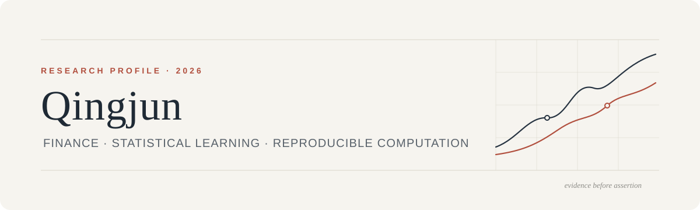

<picture>
  <source media="(prefers-color-scheme: dark)" srcset="./assets/profile-header-dark.svg">
  <source media="(prefers-color-scheme: light)" srcset="./assets/profile-header-light.svg">
  
</picture>

<p align="center">
  <strong>English</strong>&nbsp;&nbsp;·&nbsp;&nbsp;<a href="./README.zh-CN.md">中文</a>
  <br><br>
  <a href="https://studyer-tang.github.io">Website</a>&nbsp;&nbsp;·&nbsp;&nbsp;
  <a href="#research-focus">Research</a>&nbsp;&nbsp;·&nbsp;&nbsp;
  <a href="#selected-work">Work</a>&nbsp;&nbsp;·&nbsp;&nbsp;
  <a href="#research-practice">Practice</a>&nbsp;&nbsp;·&nbsp;&nbsp;
  <a href="#contact">Contact</a>
</p>

## About

I am **Qingjun**, a student at Peking University preparing for doctoral-level research. My interests sit at the intersection of **finance, statistical learning, and reproducible computation**.

I am especially interested in questions where empirical design matters as much as model performance: how evidence is constructed, how assumptions shape conclusions, and how computational results can be made auditable.

> My working principle: make the claim precise, make the evidence traceable, and make the result possible to challenge.

## Research focus

<table>
  <tr>
    <td width="50%" valign="top">
      <h3>Financial systems</h3>
      <p>Financial machine learning, market microstructure, asset pricing signals, portfolio construction, and financial time series.</p>
    </td>
    <td width="50%" valign="top">
      <h3>Reliable inference</h3>
      <p>Econometrics, statistical learning, interpretable models, robustness analysis, and uncertainty-aware evaluation.</p>
    </td>
  </tr>
  <tr>
    <td width="50%" valign="top">
      <h3>Research engineering</h3>
      <p>Reproducible experiments, provenance tracking, computational verification, and evidence-oriented workflows.</p>
    </td>
    <td width="50%" valign="top">
      <h3>Questions I care about</h3>
      <p>Data leakage, temporal validation, transaction costs, multiple testing, and the gap between statistical and economic significance.</p>
    </td>
  </tr>
</table>

## Selected work

### [Rigorous Research](https://github.com/Studyer-Tang/rigorous-research)

An evidence-gated research skill for literature review, mathematical auditing, reproducible computation, and independent verification. It turns an open-ended investigation into a staged workflow with explicit claims, acceptance gates, and review checkpoints.

`Python` · `Research methodology` · `Proof auditing` · `Reproducibility`

## Research practice

```text
Literature → Question → Formalization → Computation → Stress test → Communication
```

For substantial experiments, I aim to preserve the data source and version, preprocessing decisions, model configuration, random seeds, evaluation protocol, uncertainty, environment, and known failure cases.

My current toolkit includes **Python, R, LaTeX, Git, Jupyter, Zotero**, and the scientific Python ecosystem. Tools are secondary to the standard I want the work to meet: clear assumptions, honest limitations, and results that survive inspection.

## Current direction

- Strengthening foundations in probability, statistics, econometrics, optimization, and finance
- Reproducing empirical papers before extending their claims
- Developing research questions in quantitative finance and financial machine learning
- Exploring careful human–AI collaboration for literature discovery, verification, and research tooling

## Contact

I welcome thoughtful conversations about quantitative finance, reproducible research, statistical learning, and research tools.

**Email:** [2300010828@stu.pku.edu.cn](mailto:2300010828@stu.pku.edu.cn)<br>
**Website:** [studyer-tang.github.io](https://studyer-tang.github.io)<br>
**GitHub:** [@Studyer-Tang](https://github.com/Studyer-Tang)

---

<p align="center"><sub>Learn deeply · Build carefully · Verify everything</sub></p>
